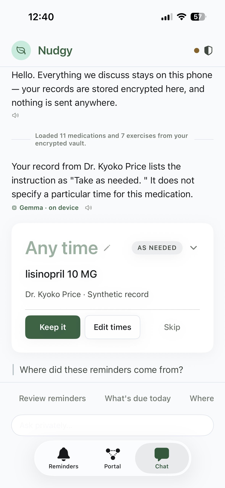
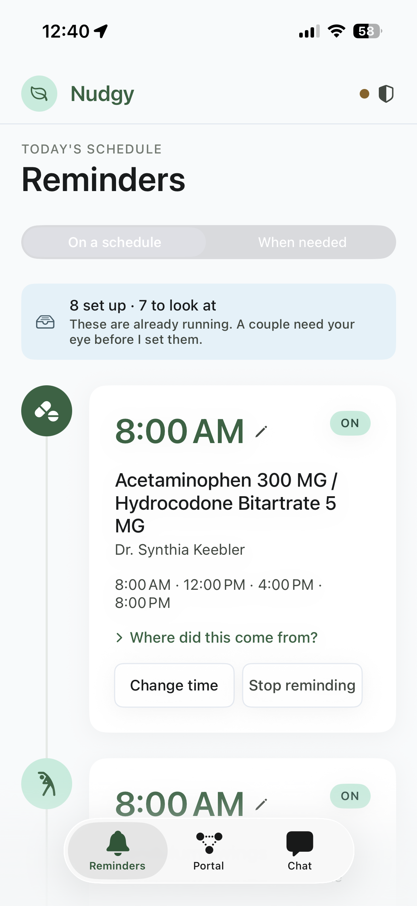
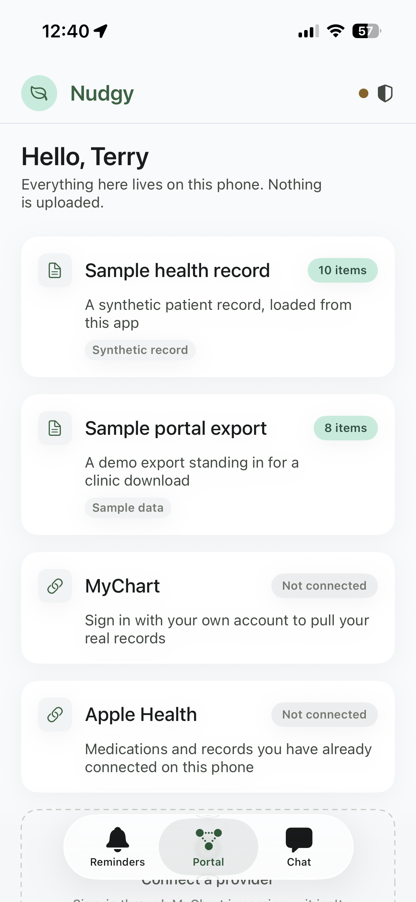

# Nudgy

A privacy-first, on-device health assistant for iOS. It turns fragmented patient-portal records
into calm, source-cited reminders for medications, physical therapy, and diet.

Health data stays on the phone. The language model runs on the phone. Nothing leaves it.

---

## The idea in one diagram

The hardest requirement in `DESIGN_DOC.md` is not the FHIR import or the notifications — it is
this pair of rules:

> Every reminder proposal must cite its source.
> If medication timing or food instructions are absent, the assistant should not invent clinical advice.

A language model cannot be trusted to honor those by instruction alone, so Nudgy does not ask it to:

```
        ┌──────────────────────────────────────┐
FHIR ─► │  DETERMINISTIC CORE (trusted)        │ ─► ReminderProposal
        │  normalizer → proposal engine        │    every field traced to a citation
        └──────────────────────────────────────┘
                        │ structured, already-decided facts
                        ▼
        ┌──────────────────────────────────────┐
        │  GEMMA (untrusted, cosmetic)         │ ─► narration
        │  phrases it warmly, answers "why?"   │
        └──────────────────────────────────────┘
                        │
                        ▼  SafetyGuard — reject → deterministic template
```

Gemma never decides a dose, a frequency, or a food instruction. Those are computed from FHIR
fields, each carrying a `SourceCitation` with the verbatim source text. Gemma phrases the result
and may choose *when* a reminder fires — labelled as its own suggestion, never as the chart's.

<p align="center">
  
</p>

That screenshot is the architecture in one sentence. Gemma 4 E2B, running on an iPhone 15, quotes
the record verbatim — *"Take as needed."* — and then states what the record **does not** say. The
card underneath shows `AS NEEDED` with no time and offers "Keep it" rather than "Approve", because
turning an as-needed prescription into a daily alarm would change what was prescribed.

On-device inference, a citation, and a refusal to invent a time, in one reply.

Full reasoning: **[ARCHITECTURE.md](ARCHITECTURE.md)** · Scope decisions: **[ROADMAP.md](ROADMAP.md)**

---

## Screens

| Reminders | Portal |
|---|---|
|  |  |
| Reminders that scheduled themselves, each traceable to its source. Times were chosen by Gemma around the others rather than stacked at a default hour. | Where records come from — and what is honestly *not* connected. Overstating this would undercut the one thing the app asks to be trusted about. |

The amber dot beside the shield is the adherence status: several reminders have gone unanswered.
It means "worth a look", never "you missed three doses" — the app knows what was tapped and what
was silence, and silence is ambiguous.

---

## Status

Running on a physical iPhone 15 with Gemma 4 E2B on the GPU backend.

| Subsystem | State | How it was verified |
|---|---|---|
| Domain model + provenance | ✅ | Provenance is unforgeable by construction |
| FHIR decoding (R4 subset) | ✅ | Real Synthea bundles + authored portal export |
| Encrypted vault | ✅ | AES-GCM, Keychain `ThisDeviceOnly`, excluded from backup |
| Normalizer + proposal engine | ✅ | **Executed** against both bundles via a CLI harness |
| Nutrition (diet, allergies, meals) | ✅ | `NutritionOrder` + care-plan diet entries |
| Tiered activation | ✅ | Unambiguous reminders self-schedule; only conflicts wait |
| Gemma 4 E2B via LiteRT-LM | ✅ | Running on device, GPU backend, ~5 s engine load |
| SafetyGuard | ✅ | **29 adversarial cases**, all passing |
| Gemma-chosen reminder times | ✅ | Schema-validated, deterministic fallback |
| Notifications | ⚠️ | Scheduled and previewable; delivery under investigation |
| Adherence ledger + status light | ✅ | Green/amber/red in-app, no streak |
| Interruption budget | ✅ | One check-in per open, one per 3 days |
| SMART on FHIR (real MyChart) | ⬜ | V2 — see ROADMAP |

---

## Running it

```sh
open ios/Nudgy.xcodeproj
```

iOS 17+, Xcode 16+.

> **Build for arm64 only.** LiteRT-LM's xcframework ships `ios-arm64` and `ios-arm64-simulator`
> slices with no x86_64. A universal simulator build fails at link time.

| Environment | Import | Engine | Notifications | Gemma |
|---|---|---|---|---|
| iOS Simulator | real | real | real | scripted fallback |
| iPhone (A16+) | real | real | real | **real Gemma 4 E2B** |

### Gemma

LiteRT-LM is vendored as a local package in `ios/ThirdParty/LiteRT-LM`, whose manifest drops
upstream's macOS binary target so an iOS build does not fetch an unused 44.6 MB artifact.

The weights are **not** in the repo. Get `gemma-4-E2B-it.litertlm` (2.41 GB) from
[`litert-community/gemma-4-E2B-it-litert-lm`](https://huggingface.co/litert-community/gemma-4-E2B-it-litert-lm).
`GemmaModelManager` looks in Application Support, then the app's Documents directory, then
downloads. To side-load it rather than wait on Wi-Fi:

```sh
xcrun devicectl device copy to --device <UDID> \
  --domain-type appDataContainer --domain-identifier app.nudgy.Nudgy \
  --source ~/NudgyModels/gemma-4-E2B-it.litertlm \
  --destination Documents/gemma-4-E2B-it.litertlm
```

Gemma 4 E2B uses Google's mixed 2/4/8-bit mobile quantization derived from QAT checkpoints:
~607 MB peak on CPU, ~1.45 GB on GPU. **Inference cannot run in the Simulator**
([LiteRT-LM #2504](https://github.com/google-ai-edge/LiteRT-LM/issues/2504)) — the app detects this
and labels its narration "Scripted" rather than passing templates off as model output.

---

## Data

No real patient data is in this repository, and none should be added.

- **`synthea-glover.json`** — trimmed from [MITRE Synthea](https://github.com/synthetichealth/synthea).
  Fully synthetic.
- **`portal-export-demo.json`** — hand-authored, tagged `data-origin: authored-demo`, which the app
  surfaces in the UI so demo data is never mistaken for a chart pull.

The authored bundle exists because Synthea's `MedicationRequest.dosageInstruction` carries only
`timing.repeat` — **no instruction text, no food instruction, no time of day**. That gap is not a
problem to work around; it is the product's central case:

> "Your chart says this is taken once daily. It does not say what time of day."

Real Synthea data drives that path. The authored bundle adds verbatim dosage text, an `ACM` timing
code, PT activities with reps and equipment, a `NutritionOrder` with excluded foods, a food
allergy, and a deliberate cross-source food-instruction conflict.

---

## Verification

Two Foundation-only harnesses compile the core outside the app and run it against real data:

- **Proposal engine** — executed against both bundles. Confirms as-needed medications produce no
  schedule, missing time-of-day is never invented, and a cross-source conflict cites both
  organizations without picking a winner.
- **SafetyGuard** — 29 adversarial cases. Rejects the design doc's own unsafe example, invented
  doses, times credited to the chart, and diagnosis language; accepts Nudgy proposing a time as its
  own idea.

The distinction SafetyGuard enforces is **attribution, not vocabulary**:

| | |
|---|---|
| *"I've set this for 9:30 — your other two are at 8:00"* | allowed |
| *"Your chart says to take this at 9:30"* | rejected |
| *"I'll remind you at 7:30, which is when your chart says"* | rejected |
| *"I can remind you to take 850 mg"* | rejected — doses are strict under every framing |

---

## Deliberately not built

Per the design doc's exclusions: no diagnosis, no treatment recommendation, no triage, no cloud
PHI processing, no SMS/voice reminders.

Scope decisions made during the build, each recorded with reasoning:

- **Voice input cut** (`ARCHITECTURE.md` §8) — outside the core loop, most failure modes in the app.
  Preserved at `ios/Deferred/SpeechCapture.swift`. Spoken read-back kept.
- **Tross declined** (`ROADMAP.md`) — its value is breadth, Nudgy's is trust.
- **Hydration reminders** — almost never in a chart, so Nudgy generating one would be inventing
  health advice. Available through user-created reminders, where the person is the source.
- **`silence` check-ins** — implemented but off behind a flag. Weakest evidence, most consequential
  wording.

Medication-label photo capture is a UI affordance only.

---

## A note for reviewers

Every bug found in this project has been **silent and open**: code placed after an earlier return,
a dead string constant that could never match after normalization, a published property no view
read, a recorder never invoked, a policy documented as enforcement but never called. None throw,
none log, and the app keeps working and reporting itself healthy.

Two examples worth knowing about:

- Chat appeared to know exactly one medication for several builds, because grounding consulted an
  arbitrary proposal before the name-matching logic beneath it.
- Gemma loaded correctly and reported "on device" while every reply was scripted, because the KV
  cache was sized for the reply and not the prompt, and `sendMessage` returned null rather than an
  error naming the cause.

Reasoning from the code produced four wrong answers to the second one. A diagnostic file written to
Documents — model state, backend names, rule identifiers, never prompts or record content —
separated all four causes in a single run.

**When reviewing this codebase, hunt for code that is never reached rather than code that throws.**

---

## Layout

```
DESIGN_DOC.md            product spec (source of truth for what Nudgy may say)
ARCHITECTURE.md          how the safety properties are structurally enforced
ROADMAP.md               data acquisition: V1, V2 MyChart, Tross decision
ios/Nudgy/
  Core/Models/           domain types; provenance is a type, not a convention
  Core/FHIR/             R4 decoding + HealthSourceConnector seam
  Core/Normalize/        FHIR → domain, capturing citations
  Core/Reminders/        deterministic proposal engine + scheduling
  Core/Language/         Gemma, SafetyGuard, ScheduleProposer, diagnostics
  Core/Adherence/        outcome ledger, pattern detection, interruption budget
  Core/Vault/            AES-GCM encrypted store
  Core/Privacy/          EgressPolicy — the only place network access is allowed
  Features/              SwiftUI: Reminders, Portal, Chat
ios/ThirdParty/          vendored LiteRT-LM package
ios/Deferred/            preserved, intentionally outside the build target
web-prototype/           original static mockup, kept for reference
```
